# SWAR AI and Evidence Flow

Status: FROZEN - Phase B  
Date: 2026-08-28

## Responsibility split

The ML service owns transient audio processing, technical score semantics, model-level calibration, and evidence readiness. NestJS owns business policy, temporal state, hysteresis, context, interventions, and audit. This split is fixed by ADR-003.

```mermaid
flowchart LR
    Track[Authorized LiveKit caller track]
    Bind[Binding validator]
    PCM[Decoded PCM and bounded ring]
    Quality[VAD and quality gate]
    Windows[Approx. 4 s windows and approx. 1 s stride\ninitial engineering setting]
    ECAPA[ECAPA identity similarity]
    Raw[RawNet2 FAST spoof score]
    Deep[AASIST DEEP spoof score]
    Cal[Verified score semantics and model-level calibration]
    Evidence[Versioned technical evidence]
    Ingest[NestJS evidence ingestion]
    Temporal[NestJS temporal policy and hysteresis]
    State[VERIFIED, UNVERIFIED, HIGH_RISK, or CRITICAL]
    Action[Warning, hold, step-up, event and audit]
    Insufficient[INSUFFICIENT_EVIDENCE plus reason codes]

    Track -->|WebRTC DTLS-SRTP; subscribe-only JWT; frames plus participant/track IDs| Bind
    Bind -->|In-process callback; authorized analysis session and exact binding; accepted frames plus sequence/timestamps| PCM
    PCM -->|In-process buffer interface; authorized analysis session; bounded samples plus signal/discontinuity metadata| Quality
    Quality -->|In-process quality interface; accepted session/window quality; valid samples plus voiced duration/reliability metadata| Windows
    Quality -->|In-process evidence interface; authorized analysis session; invalid/insufficient outcome plus reason codes/time range| Insufficient
    Windows -->|In-process model interface; authorized model profile and valid window; speaker samples plus sequence/time range| ECAPA
    Windows -->|In-process model interface; authorized model profile and valid window; spoof samples plus sequence/time range| Raw
    Windows -->|In-process asynchronous model interface; authorized model profile and valid window; spoof samples plus sequence/time range| Deep
    ECAPA -->|In-process adapter result; authorized model profile/window; raw score plus model/hash/name/direction/readiness/latency| Cal
    Raw -->|In-process adapter result; authorized model profile/window; FAST score plus model/hash/name/direction/readiness/latency| Cal
    Deep -->|In-process adapter result; authorized model profile/window; DEEP score plus model/hash/name/direction/readiness/latency| Cal
    Cal -->|In-process calibration interface; authorized calibrator/model/window; calibrated technical evidence plus uncertainty| Evidence
    Insufficient -->|Private HTTPS/TLS; ML service credential and idempotency key; INSUFFICIENT_EVIDENCE| Ingest
    Evidence -->|Private HTTPS/TLS; ML service credential and idempotency key; FAST or DEEP revision| Ingest
    Ingest -->|In-process evidence interface; validated session/revision/idempotency; accepted evidence reference plus versions| Temporal
    Temporal -->|In-process policy interface; backend policy authority and tenant scope; state plus policy/threshold versions| State
    State -->|In-process command/event interface; authorized call/action audience; binding plus reason codes| Action
```

## Window and revision contract

Each evidence event must carry:

- `organization_id`, `call_id`, `analysis_session_id`, room name, participant identity, and `track_sid` binding references;
- window sequence, start/end timestamps, revision number, and idempotency key;
- quality status, voiced duration, clipping/discontinuity/signal reason codes, and readiness/error state;
- model name/version, checkpoint hash, score name/direction, raw versus calibrated semantics, and calibration version;
- identity voiceprint/model version when identity evidence exists;
- processing latency for the producing stage and event creation time.

Expected progression:

1. Quality-valid window is assigned one stable window ID and sequence.
2. RawNet2 may emit `FAST` revision 1 with current ECAPA/quality evidence.
3. AASIST may emit `DEEP` revision 2 for that same window.
4. NestJS accepts only an authenticated event matching the current analysis/binding and a strictly newer allowed revision.
5. NestJS replaces the previous window contribution and deterministically recomputes temporal state; it does not count both revisions as separate speech.
6. Duplicate revisions are idempotent; lower/stale revisions are ignored with a non-sensitive audit/metric.
7. A result arriving after call/analysis end is recorded only as a rejected-late metric/audit reference where policy allows; it cannot change state or create/release a hold.

## Quality behavior

| Condition | ML outcome | NestJS consequence |
|---|---|---|
| Adequate valid speech | FAST followed by optional/required DEEP evidence | Use versioned evidence in temporal policy. |
| Weak but usable speech | Evidence with increased uncertainty/reason codes | Continue accumulating; do not allow one weak window to force `CRITICAL`. |
| Silence, insufficient duration, severe noise/clipping/gaps, corrupt or unsupported input | `INSUFFICIENT_EVIDENCE` | Continue monitoring; preserve/degrade protection as policy requires; never accuse solely from quality. |
| RawNet2 unavailable | Model-specific not-ready/`PIPELINE_ERROR` | Never synthesize a low spoof score; use remaining evidence only under explicitly versioned degraded policy. |
| AASIST timeout/unavailable | FAST evidence plus deep-not-ready/timeout state | Deep failure cannot silently clear existing risk; later result is subject to revision/session validity. |
| ECAPA unavailable/no voiceprint | Identity evidence unavailable | Never claim `VERIFIED`; spoof evidence can still support `HIGH_RISK`. |

## Model and policy semantics

- ECAPA answers resemblance to the expected speaker, not liveness or physical presence.
- RawNet2 and AASIST supply complementary spoof evidence; neither automatically overrides the other.
- Raw logits are not probabilities until checkpoint semantics and calibration are verified.
- The transaction value or protected-action context must never enter ML calibration or change a claimed synthetic probability.
- Initial window/stride, thresholds, smoothing, persistence, and hardware performance are `VALIDATION REQUIRED` and must not be presented as measured results.

## Required evaluation handoff

The architecture provides owners for FAR/FRR/EER, spoof precision/recall/F1/EER, calibration, unseen-generator OOD, codec/noise/language robustness, and stage/end-to-end latency. Phases K/O/Y must supply the evidence; Phase B supplies no metric values.
