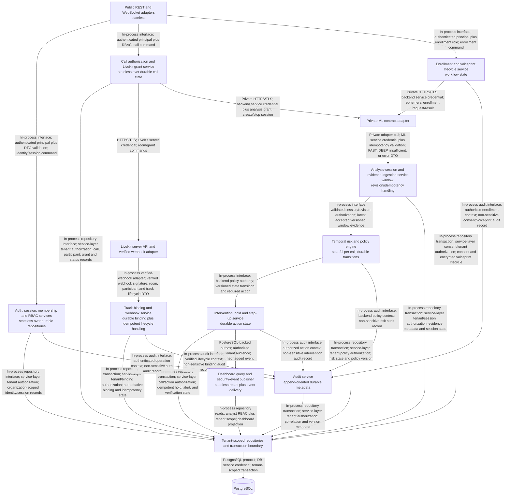
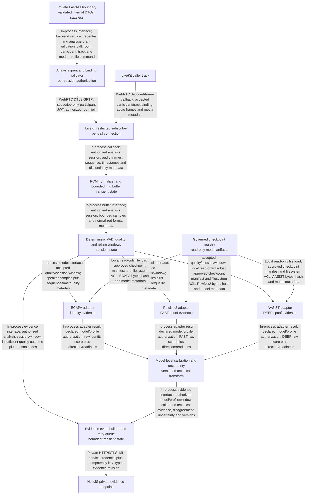

# SWAR Component Architecture and Requirement Ownership

Status: FROZEN - Phase B  
Date: 2026-08-28

## NestJS component view

## ML analysis component view

ML components never access PostgreSQL, authenticate end users, choose a business risk state, release/hold an action, or publish a customer alert. NestJS never processes waveforms or hosts PyTorch/checkpoints.

## Stateful versus stateless responsibilities

| Responsibility | State model | Recovery source |
|---|---|---|
| REST/WebSocket validation and authorization | Stateless per request/connection | JWT/session records and durable membership. |
| Call authorization and grant issue | Stateless service over durable call/binding records | PostgreSQL plus verified LiveKit lifecycle events. |
| Per-call temporal risk | Bounded stateful context with durable accepted evidence/revisions and transitions | Deterministic replay of accepted versioned evidence; no raw audio required. |
| Holds and step-up | Durable state machine | PostgreSQL transaction/idempotency records. |
| Security-event delivery/replay/ack | Durable bounded outbox plus stateless authenticated publisher | PostgreSQL stable event IDs, delivery attempts, and tenant/call-scoped acknowledgement. |
| ML audio buffers/windows | In-memory per analysis session only | Not recoverable by design; restart yields degraded/insufficient evidence and requires a new authorized subscription. |
| ML model/checkpoint/calibrator | Read-only process state, versioned | Governed artifacts and hashes. |
| Dashboard projections | Stateless query/read model | PostgreSQL durable events/state. |

## Phase A requirement ownership map

Every frozen Phase A requirement is owned below. `FUTURE` means an explicit future integration rather than an unowned SIH responsibility.

| Requirement IDs | Owning container/component | Architecture evidence |
|---|---|---|
| FR-AUTH-001, FR-AUTH-002, FR-AUTH-003, FR-AUTH-004 | NestJS Auth/session/membership/RBAC plus tenant-scoped repositories | NestJS component view; security boundaries. |
| FR-CALL-001, FR-CALL-002, FR-CALL-003, FR-CALL-005, FR-CALL-006 | NestJS Call authorization, LiveKit grant, binding/webhook services | Container view; data flow; ADR-001/002. |
| FR-CALL-004 | ML grant/binding validator plus LiveKit restricted subscriber; NestJS is binding authority | ML component view; data flow; ADR-002. |
| FR-ENR-001, FR-ENR-002, FR-ENR-003, FR-ENR-004, FR-ENR-005 | NestJS Enrollment/voiceprint lifecycle, private ML ephemeral inference, PostgreSQL encrypted record | Data flow; ADR-004; security boundaries. |
| FR-ID-001, FR-ID-002, FR-ID-003, FR-ID-004 | ML ECAPA adapter and evidence builder | AI flow; ML component view. |
| FR-SPOOF-001, FR-SPOOF-002, FR-SPOOF-003, FR-SPOOF-004 | ML RawNet2/AASIST adapters, calibration, revision event builder | AI flow; ML component view. |
| FR-QUAL-001, FR-QUAL-002, FR-QUAL-003, FR-QUAL-004 | ML PCM/VAD/quality/window/session lifecycle | AI flow; failure/fallback. |
| FR-RISK-001, FR-RISK-002, FR-RISK-003, FR-RISK-004, FR-RISK-005, FR-RISK-006 | NestJS evidence ingestion, temporal risk and policy engine | ADR-003; data/AI flow. |
| FR-INT-001, FR-INT-002, FR-INT-003, FR-INT-004 | NestJS Intervention/hold/step-up and event publisher | Data flow; failure/fallback. |
| FR-INT-005 | FUTURE contracted protected-action connector; NestJS retains policy authority | System context and scope future integration. |
| FR-API-001, FR-API-002, FR-API-003, FR-API-004, FR-API-005 | NestJS public/realtime adapters, private ML adapters, authoritative `docs/contracts/` in Phase J | Container and component views. |
| FR-DASH-001, FR-DASH-002 | React dashboard via NestJS query/event components; protection remains backend-owned | Container view; failure/fallback. |
| FR-AUD-001, FR-AUD-002, FR-AUD-003 | NestJS Audit service and PostgreSQL | Component view; security boundaries. |
| NFR-PRIV-001, NFR-PRIV-002, NFR-PRIV-003 | Cross-cutting; NestJS privacy policy, ML transient lifecycle, PostgreSQL retention, UI wording | ADR-004; security boundaries; deployment. |
| NFR-SEC-001, NFR-SEC-002, NFR-SEC-003 | Cross-cutting; all adapters validate/authenticate, secrets stay server-side, retries are bounded/idempotent | Security boundaries; failure/fallback. |
| NFR-REL-001, NFR-REL-002 | NestJS temporal/intervention recovery, ML bounded queues/sessions, LiveKit reconnect handling | Failure/fallback; deployment. |
| NFR-COMP-001 | Native infrastructure/process deployment | ADR-005; deployment. |
| NFR-COMP-002 | Android/React network adapters, NestJS public boundary, LiveKit media boundary | Container view; ADR-001. |
| NFR-ACC-001, NFR-ACC-002 | Android and React containers in Phases R-S; backend provides explicit typed states/events | Container view; FUTURE UNTIL PHASE R-S. |
| NFR-PERF-001, NFR-PERF-002 | Cross-cutting timestamps/telemetry in ML, NestJS and client delivery; measured in O/Y | AI flow; deployment; VALIDATION REQUIRED. |
| MLR-GOV-001, MLR-GOV-002 | ML governed checkpoint/calibrator registry and model adapters | ML component view; deployment. |
| MLR-ID-001 | ML evaluation workspace in Phase O | ML component/AI flow; VALIDATION REQUIRED. |
| MLR-SPOOF-001 | ML evaluation workspace in Phase O | ML component/AI flow; VALIDATION REQUIRED. |
| MLR-CAL-001 | ML calibration component and Phase O evaluation | AI flow; ADR-003; VALIDATION REQUIRED. |
| MLR-OOD-001, MLR-ROB-001, MLR-LANG-001 | ML data/evaluation workspace in K/O | AI flow; VALIDATION REQUIRED. |
| MLR-LAT-001 | ML/NestJS/client timestamp chain and Phase O/Y benchmark | AI/data flow; VALIDATION REQUIRED. |
| MLR-SAFE-001 | NestJS risk/intervention orchestration plus shared E2E tests | Data flow; ADR-003; Phase T/V evidence. |

Coverage rule: later phases may split components but shall not transfer ownership across frozen container boundaries without an approved ADR and traceability update.
