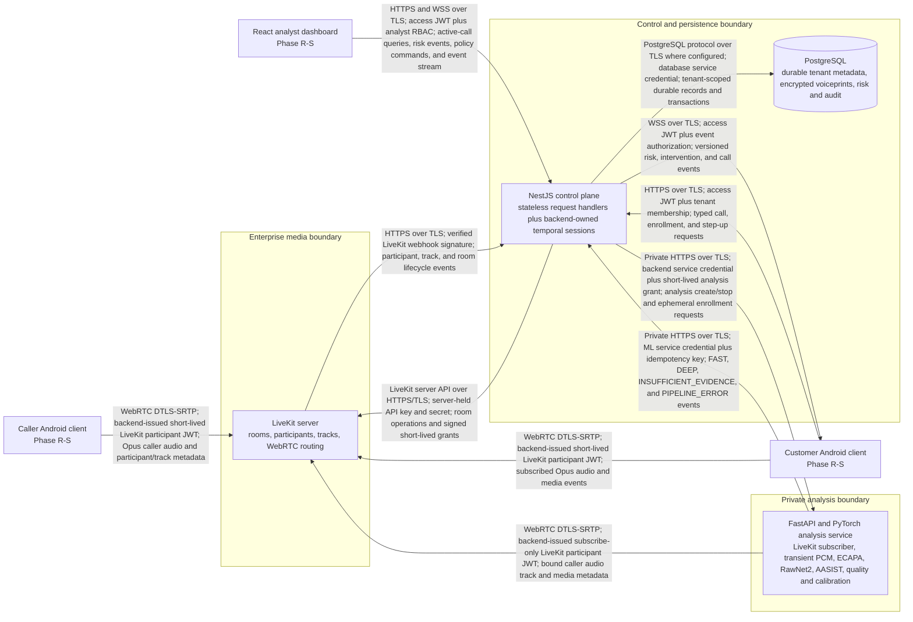

# SWAR Container Architecture

Status: FROZEN - Phase B  
Date: 2026-08-28

## Container view

Every runtime arrow states direction, protocol, authentication, and payload class. Android and React are architectural consumers but remain unimplemented until Phases R-S and the Phase Q backend gate.

## Container responsibilities and data ownership

| Container | Owns | State | Credentials held | Explicit prohibitions |
|---|---|---|---|---|
| Caller/customer Android clients | Call UI, permissions, user input, warning/haptic display, step-up initiation | Device session state only; public base URLs | User access/refresh material in secure client storage; short-lived participant JWT | No LiveKit API secret, database credential, voiceprint key, ML service credential, risk engine, or direct ML/DB access. |
| React dashboard | Analyst/admin UI and typed API/WebSocket consumption | Browser session/cache only | User access session according to frontend security design | No raw audio, database credential, model threshold authority, or direct ML/DB access. |
| NestJS control plane | Authentication, organizations, calls, grants, authoritative bindings, analysis lifecycle, temporal risk, policy, interventions, public/realtime events, audit | Durable state in PostgreSQL; bounded in-process call context may be reconstructed | JWT signing/verification material, LiveKit API credential, DB credential, backend-ML service credential, voiceprint encryption access through approved key boundary | No waveform preprocessing, PyTorch/checkpoints, persistent raw audio, frontend code, or duplicate ML calibration. |
| PostgreSQL | Durable tenant-scoped metadata and encrypted records | Stateful and authoritative for durable business state | Database service identities | No raw call audio entity, plaintext voiceprint, client access, or ML inference. |
| LiveKit server | Authorized rooms, participant identities, tracks, media routing, lifecycle webhooks | Ephemeral room/media state | LiveKit API secret and media certificates/keys in infrastructure boundary | No business risk, trusted-speaker choice, protected-action decision, or persistent call audio by SWAR default. |
| FastAPI/PyTorch analysis service | Restricted LiveKit subscription, transient PCM, windows, quality, model adapters, calibration, technical evidence | Per-call in-memory buffers/sessions only; governed model files | Short-lived subscribe-only participant JWT, ML service credential, approved checkpoint access | No end-user auth, PostgreSQL access, tenant policy, transaction action, customer alert, or frontend code. |

## Durable and transient data

| Data class | Authoritative owner | Lifetime | Forbidden destinations |
|---|---|---|---|
| User, organization, membership, device, refresh session | NestJS/PostgreSQL | Policy-controlled durable | LiveKit, ML model logs, frontend source. |
| Call, participant, room, track binding, analysis session | NestJS/PostgreSQL; LiveKit is runtime media authority | Call plus audit/retention metadata | Client self-assertion; cross-tenant access. |
| Raw audio/PCM and rolling windows | LiveKit runtime then ML process memory | Bounded call/inference lifetime; clear on stop/error | NestJS, PostgreSQL, ordinary logs, dashboard, persistent files by default. |
| Encrypted voiceprint | NestJS/PostgreSQL | Consent-bound until revocation/deletion | LiveKit, frontend, plaintext logs, unencrypted database fields. |
| FAST/DEEP/quality evidence | ML creates; NestJS ingests and owns business use | Versioned metadata retention | Direct customer model control; raw score labelled probability without calibration. |
| Risk, intervention, step-up, security event, audit | NestJS/PostgreSQL | Tenant retention policy | ML business logic; unauthenticated WebSocket consumers. |

## Network rule summary

- Public ingress terminates only at NestJS public REST/WebSocket and LiveKit WebRTC endpoints.
- FastAPI is private and accepts authenticated internal calls only.
- PostgreSQL accepts service access from NestJS only for the SIH design.
- The ML subscriber receives a backend-issued room grant and still validates the exact authorized participant/track binding.
- Raw audio never traverses NestJS, PostgreSQL, dashboard, or audit channels.

