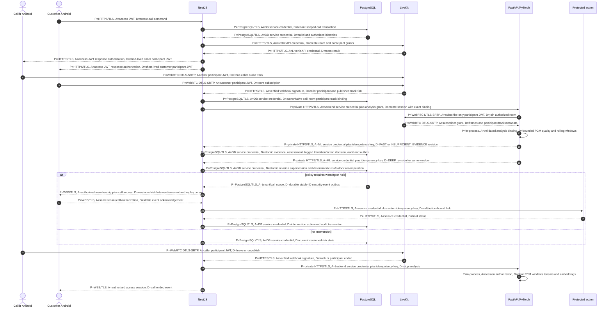
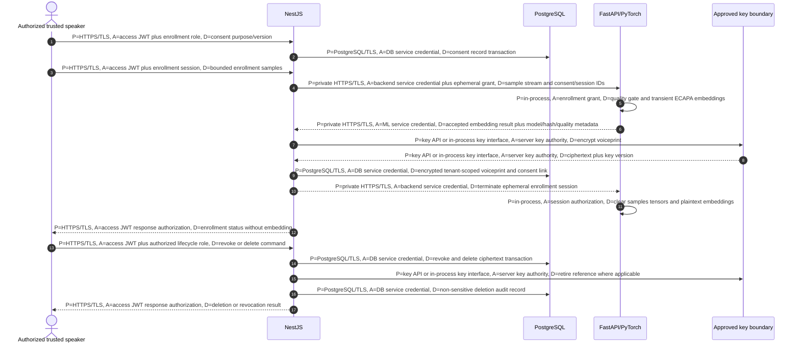
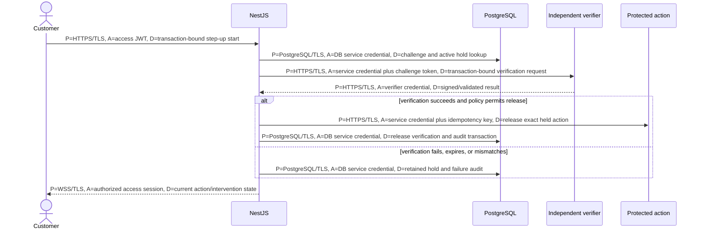

# SWAR Runtime Data Flows

Status: FROZEN - Phase B  
Date: 2026-08-28

## 1. Authorized call, analysis, risk, and intervention sequence

### Binding invariants

1. NestJS creates the authoritative tuple `(organization_id, call_id, room_name, caller_participant_identity, caller_track_sid)`.
2. The ML session grant names that tuple and an expiry; a room grant alone is insufficient authorization to analyze an arbitrary track.
3. The ML subscriber ignores non-audio, customer, screen-share, unexpected, and unbound tracks.
4. If the caller publishes multiple audio tracks, analysis does not guess: NestJS policy selects exactly one binding or stops with an explicit binding error.
5. If the caller republishes after reconnect, the new `track_sid` is quarantined until a verified webhook and authorized binding revision replace the old SID. Old and new audio never merge silently.
6. The customer hears the LiveKit-routed caller track; SWAR does not create a separate client-upload analysis stream.
7. Engineering `DEMO` and `SHADOW` modes remain explicit at evidence, assessment, transition, action,
   and event boundaries. Only independently promoted calibrated evidence may enter `PRODUCTION`.
8. The evidence revision, risk assessment, optional tagged transition/intervention decision, audit,
   and outbox insert commit or roll back as one PostgreSQL transaction.

## 2. Enrollment, encrypted storage, revocation, and deletion

Enrollment samples and plaintext embeddings exist only in bounded request/session memory. They are cleared on success, rejection, timeout, cancellation, and error. The database receives ciphertext, key version, tenant/model/consent metadata, and audit references; it receives no plaintext embedding or full audio.

## 3. Protected-action step-up

Caller audio, ECAPA similarity, and a client-side button cannot release a hold. The challenge must bind to the organization, user, call, protected action, expiry, nonce/idempotency state, and approved verification method.

## 4. Data minimization by hop

| Hop | Allowed payload | Explicitly forbidden |
|---|---|---|
| Android -> LiveKit | Authorized WebRTC media and participant metadata | LiveKit API secret; trusted-speaker assertion. |
| LiveKit -> ML | Decoded bound caller frames plus participant/track/timing metadata | Other participants/tracks; database records; business policy. |
| ML -> NestJS | Compact versioned identity/spoof/quality evidence and errors | Raw audio, full spectrograms, plaintext embeddings, private conversation content. |
| NestJS -> PostgreSQL | Tenant-scoped durable metadata, ciphertext voiceprints, policy/risk/intervention/audit | Raw call audio, plaintext voiceprints, secrets/tokens. |
| NestJS -> clients | Authorized call/risk/intervention state and non-sensitive reason codes | Service credentials, detailed probing thresholds, raw embeddings/audio. |
