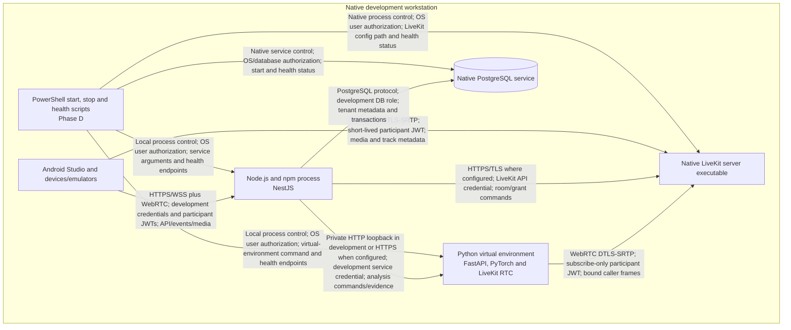
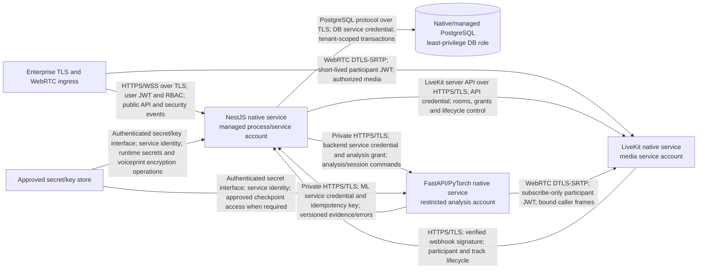

# SWAR Native Deployment Architecture

Status: FROZEN - Phase B  
Date: 2026-08-28

## Deployment decision

SWAR uses native processes and services. Docker, Docker Compose, Testcontainers, container-only setup, and Kubernetes are prohibited for the SIH build. Detailed installation and version pinning belong to Phase D/X after official compatibility verification.

## Native development topology

Development may use loopback HTTP only where Phase D explicitly documents the local trust boundary and production-equivalent service authentication. Non-loopback and production traffic requires TLS. Safe placeholder secrets may be documented in `.env.example`; real secrets never enter source.

## Production-oriented non-container topology

## Process and persistence rules

| Process/service | Run identity | Persistence | Restart behavior |
|---|---|---|---|
| NestJS | Dedicated least-privilege service account | PostgreSQL only for durable state; structured non-sensitive logs | Reconcile calls/bindings/holds before accepting evidence after restart. |
| PostgreSQL | Dedicated database service identity | Approved durable metadata and encrypted voiceprints | Backups/restores must preserve tenant scope and encryption metadata; no raw audio. |
| LiveKit | Dedicated media service identity | Runtime/config state; SWAR recording disabled by default | Lifecycle reconciliation with NestJS; participant grants remain short-lived. |
| FastAPI/PyTorch | Dedicated restricted analysis account | Governed checkpoints/config only; no call audio/session persistence | All per-call buffers lost/cleared; require new authorized analysis session. |
| Android/React | End-user context | Secure session/client state only | Reauthenticate/reconnect and fetch authoritative current state. |

## Network segmentation

- Public: NestJS HTTPS/WSS and LiveKit WebRTC/signalling only.
- Private: PostgreSQL and FastAPI; no direct frontend routes.
- Management: native service/health/secret operations under operator least privilege.
- Data: decoded audio is confined to LiveKit runtime and ML memory; voiceprint ciphertext is confined to NestJS/PostgreSQL/key boundary.

## Scaling and feasibility

The SIH target is a native single-node or small fixed deployment using PostgreSQL-backed or single-process coordination, with no Redis requirement. Supported concurrency, hardware, model placement, latency, and restart recovery remain `VALIDATION REQUIRED` for Phases D/O/Y. Future regional/on-premises pools or SIP/contact-centre adapters require separate architecture decisions and do not alter the SIH scope.
