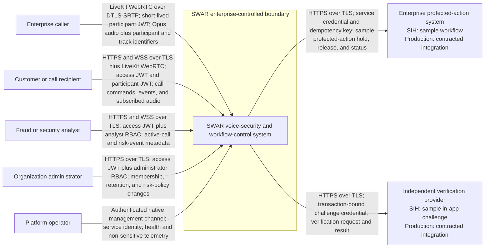

# SWAR System Context

Status: FROZEN - Phase B  
Date: 2026-08-28  
Requirements: FR-CALL-001 through FR-CALL-006; FR-RISK-001 through FR-RISK-006; FR-INT-001 through FR-INT-005; NFR-COMP-002

## Purpose and boundary

SWAR protects calls and sensitive actions inside an enterprise-controlled LiveKit/WebRTC environment. The enterprise controls user authentication, call authorization, the LiveKit deployment, the analysis service, the policy engine, and the protected-action demonstrator. Carrier networks, arbitrary telephone calls, model/data providers, and real bank-core systems are outside the SIH system boundary.

## Actors and responsibilities

| Actor | Trust level | Responsibility | Must not do |
|---|---|---|---|
| Enterprise caller | Untrusted media source; authenticated application user | Publish one authorized caller audio track for the call. | Self-assert the trusted speaker identity or analysis track. |
| Customer/call recipient | Authenticated application user; untrusted client runtime | Receive the call, warnings, and independent verification UI. | Compute or override business risk or release a server hold with caller voice. |
| Fraud/security analyst | Authenticated tenant-scoped privileged user | Review versioned evidence, interventions, and audit history. | Access raw call audio or another organization's records. |
| Organization administrator | Authenticated tenant-scoped privileged user | Manage memberships and authorized policy within approved constraints. | Change model evidence or bypass calibration/tenant scope. |
| Platform operator | Least-privilege service operator | Operate native services and non-sensitive telemetry. | Read conversation content, embeddings, or tenant data without explicit role. |
| Protected-action system | External integration boundary | Enforce a transaction/action-bound hold and idempotent release. | Treat a warning alone as proof; accept an unbound release. |
| Independent verification provider | Separate trust factor | Resolve a transaction-bound challenge independently of the call voice. | Use caller-provided phone numbers or voice similarity as the factor. |

## System outcomes

- `VERIFIED`: high identity evidence and low spoof evidence.
- `UNVERIFIED`: low identity evidence and low spoof evidence; never `SAFE`.
- `HIGH_RISK`: low identity evidence and high spoof evidence.
- `CRITICAL`: high identity evidence and high spoof evidence, requiring warning/hold policy.
- `INSUFFICIENT_EVIDENCE` is an ML evidence outcome and continued-monitoring condition, not a fifth user-facing risk state.

## Out-of-scope context

- arbitrary GSM, VoLTE, carrier, or third-party call interception;
- direct Android-to-FastAPI or frontend-to-database communication;
- production bank-core, SIP/contact-centre, or external step-up integration without a contract;
- persistent raw-call-audio storage by default;
- Docker/container-only deployment or frontend implementation before the Phase Q gate.

