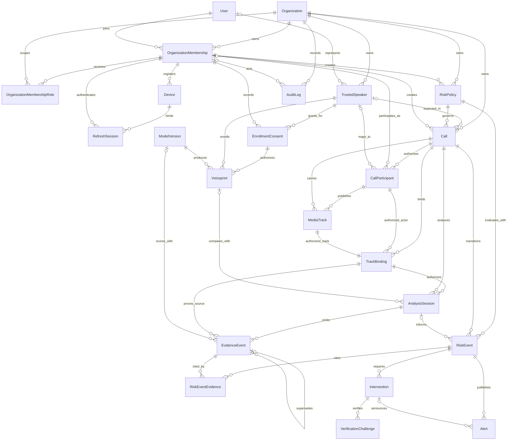

# SWAR entity-relationship diagram

Version: 1.0.0  
Frozen: 2026-08-28

The diagram mirrors the models in `backend/prisma/schema.prisma`. Tenant relations shown here are implemented with `organizationId` plus entity IDs; the schema is authoritative for exact field and constraint syntax.

## Aggregate roots and ownership

| Aggregate | Root | Internal records | Cross-aggregate references |
|---|---|---|---|
| Tenant identity | `Organization` | `OrganizationMembership`, `OrganizationMembershipRole`, `Device`, `RefreshSession` | Global `User` |
| Enrollment | `TrustedSpeaker` | `EnrollmentConsent`, `Voiceprint` | `OrganizationMembership`, global `ModelVersion` |
| Controlled call | `Call` | `CallParticipant`, `MediaTrack`, `TrackBinding`, `AnalysisSession` | `TrustedSpeaker`, `RiskPolicy` |
| Risk decision | `RiskEvent` | `RiskEventEvidence` | `Call`, `AnalysisSession`, `EvidenceEvent`, `RiskPolicy` |
| Intervention | `Intervention` | `VerificationChallenge`, related `Alert` | `RiskEvent`, `Call`, resolving membership |
| Governance/audit | `ModelVersion`, `RiskPolicy`, `AuditLog` | Version and append-only records | Tenant actors and opaque audited targets |

## Authoritative binding key

The durable media authorization tuple is:

`organizationId + callId + CallParticipant.livekitIdentity + MediaTrack.trackSid + TrackBinding.revision`

`displayName`, client-provided labels, room metadata, and track labels do not replace this tuple. A new SID creates a new track/binding revision.
