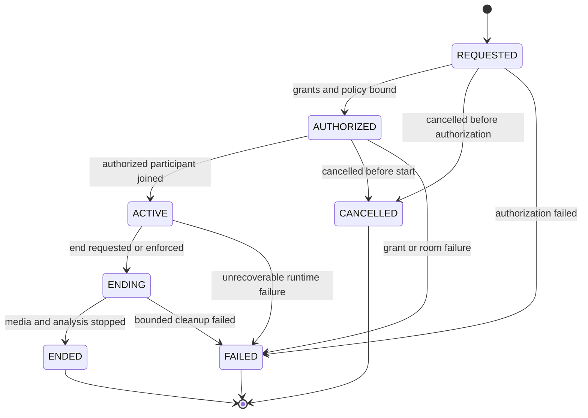
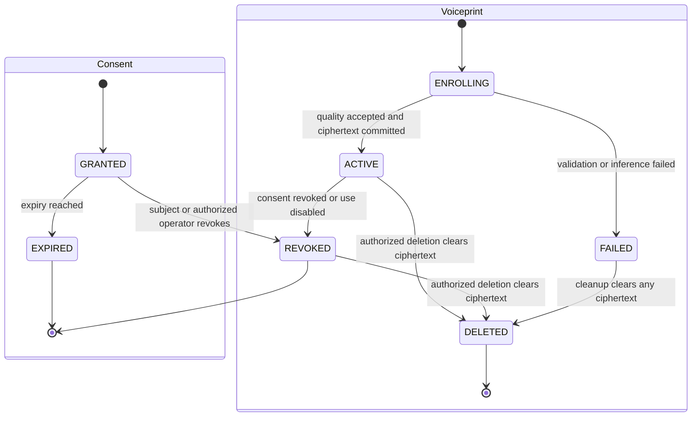
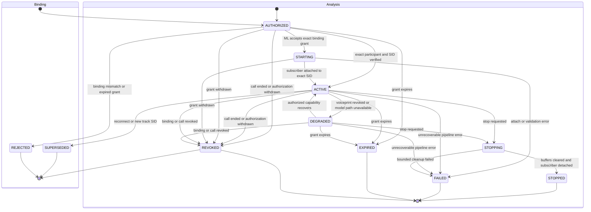
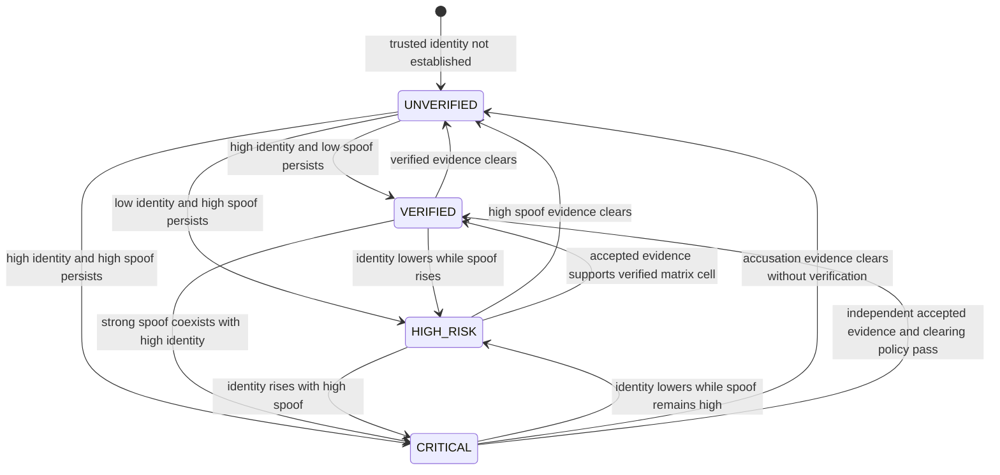
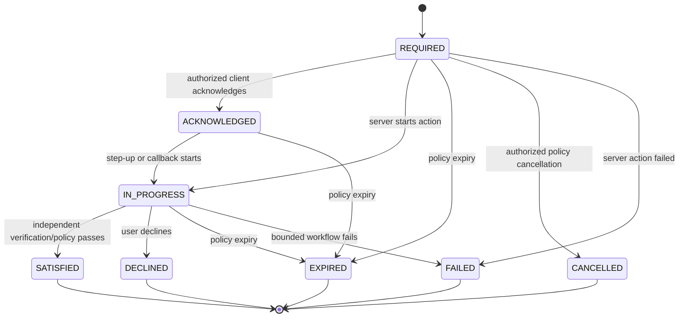

# SWAR domain state machines

Version: 1.0.0  
Frozen: 2026-08-28

Transitions are executed by NestJS in tenant-scoped transactions with optimistic/current-state checks, stable idempotency keys, audit records, and explicit errors. A repeated request with the same key returns the committed result; the same key with different input is rejected. Unlisted transitions are illegal.

## Call lifecycle

`ENDED`, `CANCELLED`, and `FAILED` are terminal. Ending a call revokes grants/bindings, stops analysis, clears transient audio/embeddings, and records a versioned event; it does not delete durable minimal evidence.

## Consent and voiceprint lifecycles

Revocation prevents future use immediately. Deletion requires `ciphertext = null`, `deletedAt` set, no plaintext material retained, and an audit event. Re-enrollment creates new consent/voiceprint versions; it never reactivates a deleted record.

## Track binding and analysis lifecycles

A superseded/revoked/rejected binding cannot accept new evidence. Recovery from `DEGRADED` is allowed only if the same authorized binding remains active; voiceprint revocation cannot be reversed by recovery and requires a new authorized session for later re-enrollment.

## Evidence revision rules

Evidence events are immutable facts, not mutable states:

1. Transport replay uses the same tenant/idempotency key and returns the original event.
2. A unique `(organization, analysisSession, windowSequence, evidenceType, revision)` identifies one semantic revision.
3. A replacement uses a greater revision and `supersedesEvidenceId`; the prior event becomes `SUPERSEDED` only through a controlled classification update or is already inserted with its final acceptance classification in the same transaction.
4. A lower/equal conflicting revision is `STALE`/`REJECTED`; identical content is `DUPLICATE`.
5. FAST and DEEP are distinct evidence types and may arrive out of order. Risk evaluation uses accepted facts in semantic window order and creates a new immutable risk event when late evidence changes state.
6. Model, checkpoint, score direction, calibration, and schema snapshots are never rewritten.

## Risk state machine

Each arrow requires the active versioned policy's persistence/hysteresis conditions; Phase Q defines settings only after Phase O calibration evidence. Same-state evidence updates the timeline without inventing a state transition. `INSUFFICIENT_EVIDENCE` and `PIPELINE_ERROR` continue monitoring/degraded protection and cannot independently enter `HIGH_RISK` or `CRITICAL`. `UNVERIFIED` is never named safe.

## Intervention, verification, and alert lifecycles

- A `HOLD_PROTECTED_ACTION` remains effective through WebSocket/dashboard/ML disconnection and is released only after `SATISFIED` under authorized policy.
- Verification: `PENDING -> PASSED | FAILED | EXPIRED | CANCELLED`; each retry is a new bounded `attemptNumber`. No OTP/answer is persisted in this model.
- Alert: `PENDING -> DELIVERED | FAILED | CANCELLED`. Retry increments `attemptCount` under a later bounded-delivery policy; an alert failure never changes risk or releases a hold.

## Four mandatory orchestration walks

| Scenario | Accepted evidence | Risk/event result | Intervention behavior |
|---|---|---|---|
| Genuine trusted speaker | Quality-ready, high expected-speaker similarity, low spoof evidence, versioned model facts | `VERIFIED` after policy persistence; linked immutable `RiskEvent` | No accusation or hold solely from this scenario. |
| Unknown genuine speaker | Quality-ready, low identity, low spoof | `UNVERIFIED`; never a safe label | Continue monitoring; protected workflow may require normal independent authorization. |
| Trusted voice clone | Quality-ready, high identity and high spoof | `CRITICAL` after policy persistence | Idempotent warning plus server-side hold; independent step-up/callback required. |
| Weak/insufficient audio | `INSUFFICIENT_EVIDENCE` with reason codes | Retain current state or degraded/monitoring outcome per policy; no synthetic accusation | Continue monitoring; do not create `CRITICAL` from quality failure. |

These walks prove only contract orchestration. They contain no model score, threshold, accuracy, or latency claim.

## Transaction and concurrency rules

- Transition commands compare the current status/version and write domain record plus audit/outbox alert intent atomically where applicable.
- Scoped sequences are allocated/checked inside the call or analysis transaction. Late arrival time never overrides semantic sequence/revision.
- A version activated concurrently with an active call does not rewrite that call's frozen policy version or any existing event snapshot.
- Deletion/revocation wins over in-flight enrollment/analysis: dependent writes re-check consent/voiceprint/binding status before commit and fail explicitly when no longer valid.
